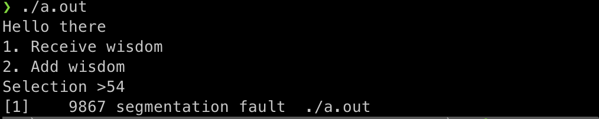
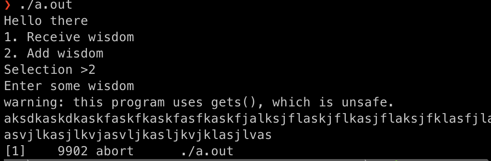
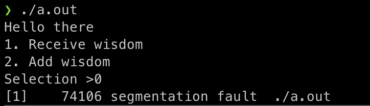
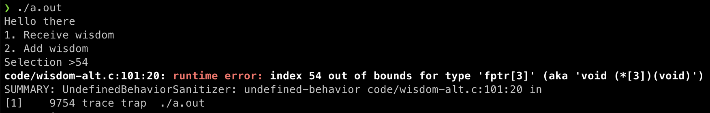
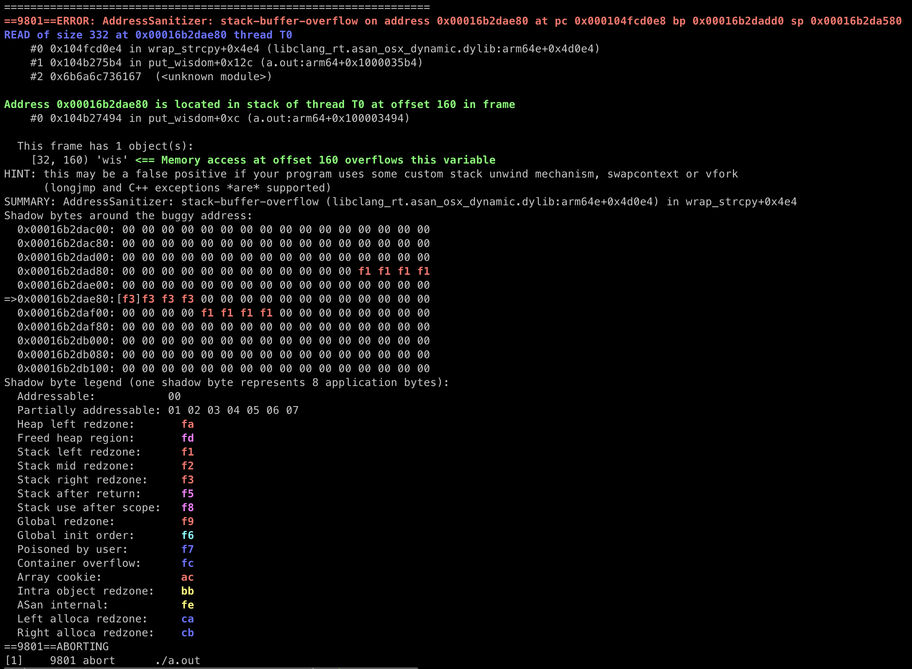
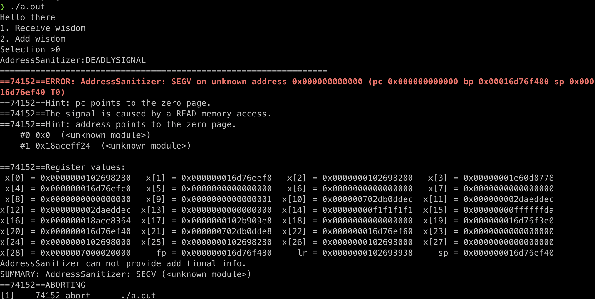

1. Внимательно читаем, что ИСП-РАН называет [безопасной компиляцией 1 класса](https://www.ispras.ru/technologies/safecomp/)
2. Внимательно смотрим, какие параметры использует ИСП-РАН в своей [презентации](SAFEC.pdf) для безопасного компилятора 1 класса (а также 2 и 3 класса) 
3. Берем исходный код из папки `code` или с [GitHub](https://github.com/KarenWest/softwareSecurity/blob/master/wisdom-alt.c)
4. Компилируем код просто без всего, чтобы посмотреть как он раньше работал
   1. Запускаем `gcc code/wisdom-alt.c`
   2. Запускаем `./a.out`
   3. Вводим число больше 3 - получаем SegFault 
   4. Перезапускам
   5. Вводим число 2
   6. Вводим строку больше 1024 символов - получаем SegFault 
   7. Перезапускаем
   8. Вводим число 0, чтобы обратится по адресу `null` - получаем SegFault 
5. Компилируем код "безопасно" (сама лабораторная работа)
   1. Запускам `./gcc-safe.sh` (строка запуска очень большая, поэтому выделил её в отдельный файлик-скриптик)
   2. Запускаем `./a.out`
   3. Вводим число больше 3 - получаем [ошибку с описанием того что произошло](./output/undefined-behavior-sanitizer.log) 
   4. Перезапускаем 
   5. Вводим число 2
   6. Вводим строку больше 1024 символов - получаем [разноцветную ошибку с описанием того что произошло](./output/address-sanitizer.log) 
   7. Перезапускаем
   8. Вводим число 0, чтобы обратится к адресу `null` - [получаем красивое описание ошибки](./output/nullref-sanitizer.log)  
   9. В целом, самое главное это параметры `-fsanitize` - остальные не нужно, можно вообще их убрать
6. В теории, на этом всё, но по хорошему нужно
   1. Открываем прошлую лабы про wisdom-alt
   2. Выполняем все до получения `Achievement unlocked!`. Этого будет достаточно
   3. Если текущее поведение отличается от поведения в предыдущей лабе, то фотографируем, добавляем в отчет
   4. Дальше делать не нужно. Если получилось/не получилось с `Achievement unlocked!`, то для последующих задач результат будет тем же.
7. Собираем отчет
   1. Заполняем текст по примеру этого списка
   2. Делаем фотки. Всё нужное находится в `/img`
   3. Собираем всё в один док 